# How to Install Teranode with Kubernetes Helm

Last modified: 29-October-2025

## Index

- [Introduction](#introduction)
- [Prerequisites](#prerequisites)
- [Deployment with Minikube](#deployment-with-minikube)
    - [Start Minikube](#start-minikube)
    - [Deploy Dependencies](#deploy-dependencies)
    - [Create Persistent Volume Provider](#create-persistent-volume-provider)
    - [Load Teranode Images](#load-teranode-images)
    - [Deploy Teranode](#deploy-teranode)
- [Verifying the Deployment](#verifying-the-deployment)
- [Production Considerations](#production-considerations)
    - [Scaling the Propagation Service](#scaling-the-propagation-service)
- [Other Resources](#other-resources)

## Introduction

This guide provides instructions for deploying Teranode in a Kubernetes environment. While this guide shows the steps to deploy on a single server cluster using Minikube, these configurations can be adapted for production use with appropriate modifications.



## Hardware Requirements

For detailed hardware specifications including per-service resource requirements, see the [System Requirements](../systemRequirements.md) document.

Kubernetes deployments require:

- Sufficient cluster resources for Teranode pods
- External dependencies (Aerospike, PostgreSQL, Kafka) deployed separately or as managed services
- ReadWriteMany (RWX) storage for shared blob storage

## Prerequisites

Before you begin, ensure you have the following tools installed and configured:

- [Docker](https://docs.docker.com/get-docker/)
- [Minikube](https://minikube.sigs.k8s.io/docs/start/)
- [kubectl](https://kubernetes.io/docs/tasks/tools/)
- [Helm](https://helm.sh/docs/intro/install/)

Additionally, ensure you have a storage provider capable of providing ReadWriteMany (RWX) storage. As an example, this guide includes setting up an NFS server via Docker for this purpose.


## Download the Teranode source code

```bash
cd $YOUR_WORKING_DIR
git clone git@github.com:bsv-blockchain/teranode.git
cd teranode
```

## Deployment with Minikube

Minikube creates a local Kubernetes cluster on your machine. For running Teranode, we recommend the following process:


### Start Minikube

Start minikube with recommended resources and verify its status:

```bash
# Start minikube with recommended resources
minikube start --cpus=4 --memory=8192 --disk-size=20gb

# Verify minikube status
minikube status
```

### Deploy Dependencies

Teranode requires several backing services. While these services should be deployed separately in production, for local development we'll deploy them within the same cluster.

#### Create Namespace

Create a namespace for the deployment:

```bash
kubectl create namespace teranode-operator
```

#### Deploy Backing Services

Deploy all dependencies in the teranode namespace:

```bash
kubectl apply -f deploy/kubernetes/aerospike/ -n teranode-operator
kubectl apply -f deploy/kubernetes/postgres/ -n teranode-operator
kubectl apply -f deploy/kubernetes/kafka/ -n teranode-operator
```

To know more, please refer to the [Third Party Reference Documentation](../../../references/thirdPartySoftwareRequirements.md)

### Create Persistent Volume Provider

For this example, we will create a local folder and expose it to Minikube via a docker based NFS server.

#### Standard x86/x64 Systems

```bash
docker volume create nfs-volume

docker run -d \
    --name nfs-server \
    -e NFS_EXPORT_0='/minikube-storage *(rw,no_subtree_check,fsid=0,no_root_squash)' \
    -v nfs-volume:/minikube-storage \
    --cap-add SYS_ADMIN \
    -p 2049:2049 \
  erichough/nfs-server

# connect the nfs-server to the minikube network
docker network connect minikube nfs-server

# create the PersistentVolume
kubectl apply -f deploy/kubernetes/nfs/
```

### Load Teranode Images

Pull and load the required Teranode images into Minikube:

#### Identify Available Versions

You can find the latest available version published on GitHub Container Registry:

- <https://github.com/bsv-blockchain/teranode/pkgs/container/teranode>
- <https://github.com/bsv-blockchain/teranode-operator/pkgs/container/teranode-operator>

#### Set Image Versions

```bash
# Set image versions (please derive the right TERANODE_VERSION from the results of the previous command)
export OPERATOR_VERSION=v0.2.8
export TERANODE_VERSION=v0.14.4
export GHCR_REGISTRY=ghcr.io/bsv-blockchain
```

#### Load Images into Minikube

```bash
# Load Teranode Operator
docker pull $GHCR_REGISTRY/teranode-operator:$OPERATOR_VERSION
minikube image load $GHCR_REGISTRY/teranode-operator:$OPERATOR_VERSION

# Load Teranode Public
docker pull $GHCR_REGISTRY/teranode:$TERANODE_VERSION
minikube image load $GHCR_REGISTRY/teranode:$TERANODE_VERSION
```

### Deploy Teranode

The Teranode Operator manages the lifecycle of Teranode instances:

#### Install Teranode Operator

```bash
# Install CRDs first
kubectl apply --server-side -f https://raw.githubusercontent.com/bsv-blockchain/teranode-operator/$OPERATOR_VERSION/deploy/crds.yaml
# Install operator
helm upgrade --install teranode-operator oci://ghcr.io/bsv-blockchain/helm/teranode-operator \
    -n teranode-operator \
    -f deploy/kubernetes/teranode/teranode-operator.yaml
```

#### Create the Teranode Secret

Sensitive settings (`blockchain_store` and `utxostore` — they contain database
credentials and connection strings — plus `grpc_admin_api_key`) are **not** stored in
the ConfigMap. They are supplied through a Kubernetes Secret named
`teranode-operator-secrets`, which the Cluster CR references via `spec.envFrom`. This
Secret is intentionally not committed to the repository — you must create it yourself.

`grpc_admin_api_key` is **required** for a working node. It authenticates every
state-mutating P2P `PeerService` RPC, including the peer-reputation and
validated-chain-progress reports that decide which peer this node syncs from, and the
`operator` context binds that gRPC port on all interfaces. It is deliberately not
committed to this repository, and well-known placeholders such as `testkey` are
rejected and ignored — the server then uses a random key, so every protected RPC,
including the internal reporters, fails with `Unauthenticated`. Generate a strong
random value, for example `openssl rand -hex 32`.

Create it with a manifest (replace the example values with your own credentials):

```yaml
# teranode-secret.yaml — DO NOT commit this file
apiVersion: v1
kind: Secret
metadata:
  name: teranode-operator-secrets
  namespace: teranode-operator
type: Opaque
stringData:
  blockchain_store: "postgres://POSTGRES_EXAMPLE_URI_CHANGE_ME"
  utxostore: "aerospike://AEROSPIKE_EXAMPLE_URI_CHANGE_ME"
  # Required. Authenticates the state-mutating P2P PeerService RPCs.
  # Generate with: openssl rand -hex 32
  grpc_admin_api_key: "GRPC_ADMIN_API_KEY_CHANGE_ME"
```

```bash
kubectl apply -f teranode-secret.yaml -n teranode-operator
```

The keys in the Secret are injected into the Teranode pods as environment variables,
overriding the corresponding settings. Keep the Secret out of version control and
rotate the database credentials for production deployments.

If you manage your keys via different secret providers ([1password](https://github.com/1Password/onepassword-operator), [External Secrets](https://github.com/external-secrets/external-secrets), [Vault](https://github.com/hashicorp/vault-secrets-operator)), please make sure that the secret passed to Teranode Operator is ready.

#### Apply Teranode Configuration

Apply the Teranode configuration and custom resources:

```bash
kubectl apply -f deploy/kubernetes/teranode/teranode-configmap.yaml -n teranode-operator
kubectl apply -f deploy/kubernetes/teranode/teranode-cr.yaml -n teranode-operator
```

**Network Configuration:**

By default, this configuration deploys Teranode to connect to the **teratestnet** network. To connect to a different network:

1. Edit `deploy/kubernetes/teranode/teranode-configmap.yaml` and change the `network` setting:

    - For BSV testnet: `network: "testnet"`
    - For BSV mainnet: `network: "mainnet"`

2. For **testnet** or **mainnet**, you must enable the legacy service in `deploy/kubernetes/teranode/teranode-cr.yaml`:

    ```yaml
    legacy:
      enabled: true
      spec:
        deploymentOverrides:
          imagePullPolicy: Never
          replicas: 1
          resources:
            requests:
              cpu: 100m
              memory: 256Mi
    ```

    The `imagePullPolicy: Never` and `cpu: 100m` / `memory: 256Mi` values above
    are Minikube/local-dev defaults — the legacy service scans the full
    historical chain and needs far more than that in practice. For testnet or
    mainnet, size resources from the shipped mainnet CR instead, which requests
    `cpu: 2` / `memory: 64Gi` for legacy: see
    [teranode-cr-mainnet.yaml](https://github.com/bsv-blockchain/teranode/blob/main/deploy/kubernetes/teranode/teranode-cr-mainnet.yaml).

3. Apply the updated configuration:

    ```bash
    kubectl apply -f deploy/kubernetes/teranode/teranode-configmap.yaml -n teranode-operator
    kubectl apply -f deploy/kubernetes/teranode/teranode-cr.yaml -n teranode-operator
    ```

#### Start Syncing Process

A fresh Teranode starts up in IDLE state by default. To start syncing from the network, you can run:

```bash
kubectl exec -it $(kubectl get pods -n teranode-operator -l app=blockchain -o jsonpath='{.items[0].metadata.name}') -n teranode-operator -- teranode-cli setfsmstate -fsmstate running
```

To know more about the syncing process, please refer to the [Teranode Sync Guide](minersHowToSyncTheNode.md)

## Verifying the Deployment


To verify your deployment:

```bash
# Check all pods are running
kubectl get pods -n teranode-operator | grep -E 'aerospike|postgres|kafka|teranode-operator'

# Check Teranode services are ready
kubectl wait --for=condition=ready pod -l app=blockchain -n teranode-operator --timeout=300s

# View Teranode logs
kubectl logs -n teranode-operator -l app=blockchain -f
```

## Production Considerations

For production deployments, consider:

- Deploying dependencies (Aerospike, PostgreSQL, Kafka) in separate clusters or using managed services
- Implementing proper security measures (network policies, RBAC, etc.)
- Setting up [monitoring and alerting](../minersHowToMonitoring.md)
- Configuring appropriate resource requests and limits
- Setting up proper backup and disaster recovery procedures

An example CR for a mainnet deployment is available in [kubernetes/teranode/teranode-cr-mainnet.yaml](https://github.com/bsv-blockchain/teranode/blob/main/deploy/kubernetes/teranode/teranode-cr-mainnet.yaml).

### Scaling the Propagation Service

The propagation service is stateless and horizontally scalable: set
`propagation.enabled: true` (both shipped example CRs ship it disabled) and
`propagation.spec.deploymentOverrides.replicas` in `teranode-cr.yaml` (or
`teranode-cr-mainnet.yaml`) to the desired pod count, then re-apply the CR. If
the propagation spec has no `deploymentOverrides` block yet — as in
`teranode-cr.yaml` — add one.

Not every service in the Cluster CR can be scaled this way. The validator can:
`teranode-cr-mainnet.yaml` runs it with 8 replicas (`teranode-cr.yaml` ships the
validator disabled, with an empty spec). Services such as block assembly and
blockchain are single-instance — block assembly holds the mining jobs handed to
miners and its assembler state per process, so a second replica would lose
solved blocks and clobber that state. That is why every
`deploymentOverrides.replicas` entry in both example CRs is `1`, the one
exception being the validator in `teranode-cr-mainnet.yaml`.

A `HorizontalPodAutoscaler` that targets the `Propagation` custom resource's
`/scale` endpoint will not work. The Teranode Operator's `Propagation` CR does
declare a Kubernetes `/scale` subresource, with its `specReplicasPath` pointing
at `.spec.deploymentOverrides.replicas`, which is the mechanism an HPA would
normally use to target a custom resource directly. In practice this doesn't hold
up: the parent `Cluster` controller reconciles every child resource, including
`Propagation`, both on a fixed one-minute timer and whenever the `Propagation`
object's spec changes (which an HPA writing to `/scale` would trigger). On each
of those reconciles it overwrites the entire `Propagation` spec — including the
replica count — with whatever is stored in the `Cluster` CR itself. Any replica
count an HPA writes to `/scale` gets reverted within at most a minute, so
autoscaling against that endpoint silently flaps rather than converging.

Until the operator changes this reconcile behavior (e.g. by leaving
externally-managed replica counts alone), manual scaling via
`deploymentOverrides.replicas` in the `Cluster` CR remains the supported way to
size the propagation service.

## Related Documentation

- [Monitoring Teranode](../minersHowToMonitoring.md)
- [Prometheus Metrics Reference](../../../references/prometheusMetrics.md)

## Resetting Teranode

If you need to reset your Teranode deployment, see the [How to Reset Teranode](minersHowToResetTeranode.md) guide for complete instructions on cleaning up Aerospike, PostgreSQL, and persistent volumes.

## Other Resources

- [Third Party Reference Documentation](../../../references/thirdPartySoftwareRequirements.md)
- [Teranode Sync Guide](minersHowToSyncTheNode.md)
- [How to Reset Teranode](minersHowToResetTeranode.md)
- [How-To Configure the Node](minersHowToConfigureTheNode.md)
