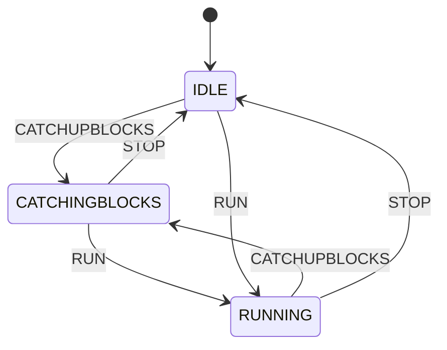

# State Machine

The mermaid diagram outlined below represents the various states and events that dictate the functionality of the node. To create and visualize the state machine diagram, you can use <https://mermaid.live/>. This tool allows you to generate the diagram visualization interactively.

The `[*] --> IDLE` arrow below is the state machine's constructor default, not the state a node boots in. `Init` puts a fresh node straight into `CATCHINGBLOCKS` (and a restarted one into whatever it last persisted) with `SetState`, which does not go through an event and so does not appear as an edge here.

